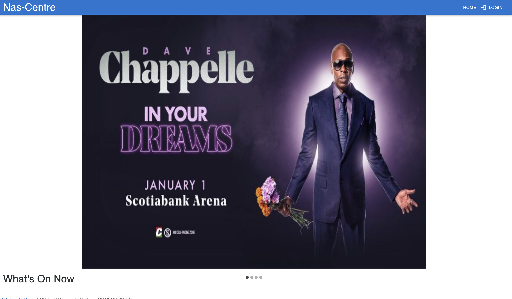
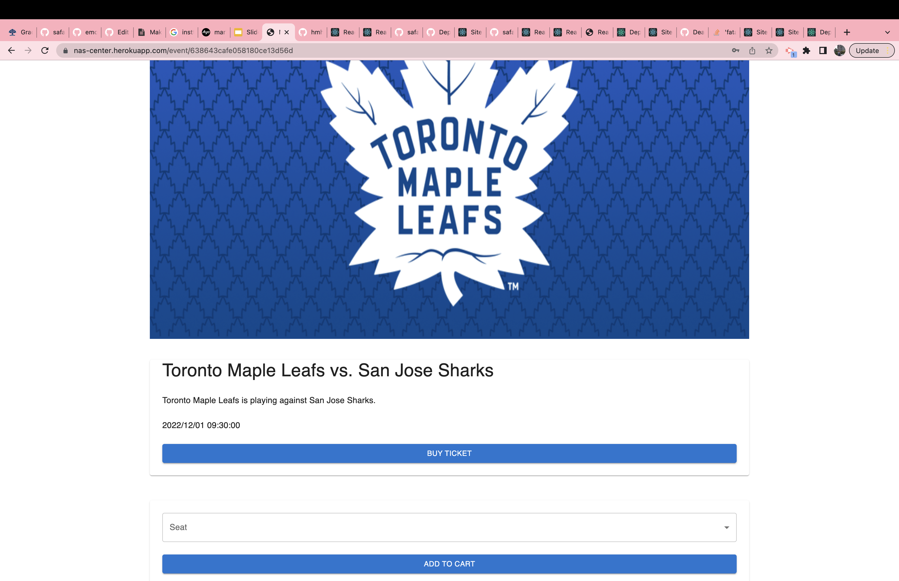
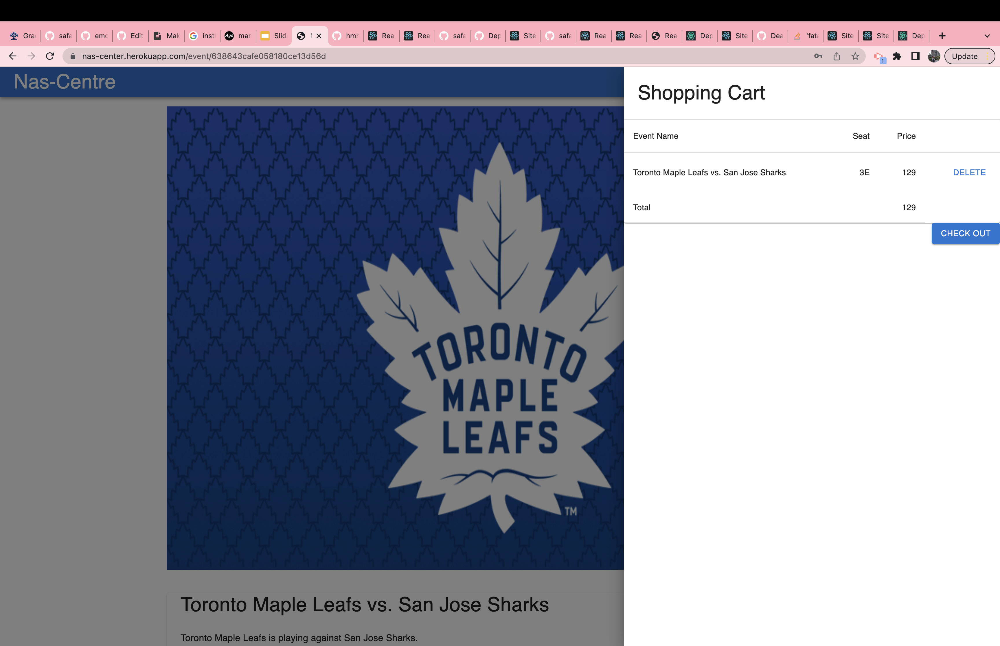
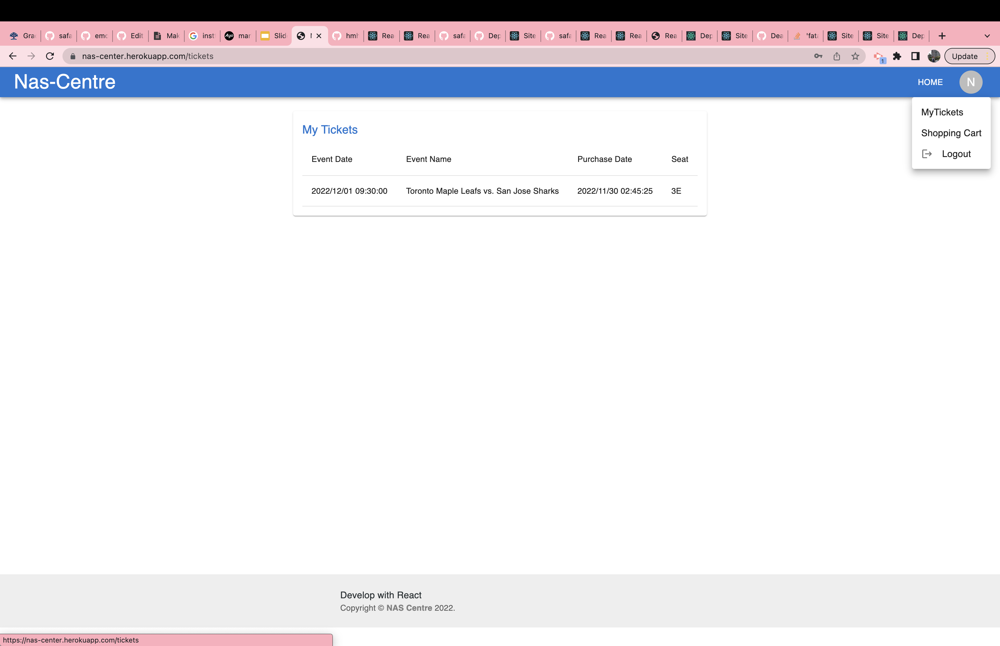

# NAS-Centre
 An event center which it 's name is decided by coin flip.


 ## Description 📖:

 - Nas Center is platforme to buy online for concerts, sports, theater, family and other upcoming events in the center 

```
 AS a user,
I WANT to view different events in the location
SO THAT I can purchase ticket for that event online

```

## Features ⚙️:

```
WHEN I open the main page
THEN I  see carousel image slider of posters for recent events, and a list of most recent events for the location
WHEN I view the header
THEN I am presented with Logo, Login/Signup button
WHEN I view the event list
THEN I am presented with categories we can choose from
WHEN I click on the category
THEN I am presented with a list of most recent events for that category
WHEN I click on a specific event
THEN I am presented the with the event detail and show times for the event
WHEN I click on the buy ticket
THEN I am will be asked to login or signup first
When I want to buy while I'm logged in 
Then I redirected to the checkout page (stripe) 
```
## Installation 🛠️:

No installaions required just use the link


 ## Built With 🧰: 
 
  * 
* 
* 
* 
* 
* 
* 
* 


## Heroku deploy 🔗

link to the app 

 https://nas-center.herokuapp.com/


 ## Screenshots 📸:

 The following image demonstrates the web application's appearance and functionality:

 - Home page

 

- Login/ sing up :

 

 - Single Event page:

  

  - Cart page:

   

   - Ticket page

   

   ## License

   MIT License

Copyright (c) 2022 hmhtom

Permission is hereby granted, free of charge, to any person obtaining a copy
of this software and associated documentation files (the "Software"), to deal
in the Software without restriction, including without limitation the rights
to use, copy, modify, merge, publish, distribute, sublicense, and/or sell
copies of the Software, and to permit persons to whom the Software is
furnished to do so, subject to the following conditions:

The above copyright notice and this permission notice shall be included in all
copies or substantial portions of the Software.

THE SOFTWARE IS PROVIDED "AS IS", WITHOUT WARRANTY OF ANY KIND, EXPRESS OR
IMPLIED, INCLUDING BUT NOT LIMITED TO THE WARRANTIES OF MERCHANTABILITY,
FITNESS FOR A PARTICULAR PURPOSE AND NONINFRINGEMENT. IN NO EVENT SHALL THE
AUTHORS OR COPYRIGHT HOLDERS BE LIABLE FOR ANY CLAIM, DAMAGES OR OTHER
LIABILITY, WHETHER IN AN ACTION OF CONTRACT, TORT OR OTHERWISE, ARISING FROM,
OUT OF OR IN CONNECTION WITH THE SOFTWARE OR THE USE OR OTHER DEALINGS IN THE
SOFTWARE.


